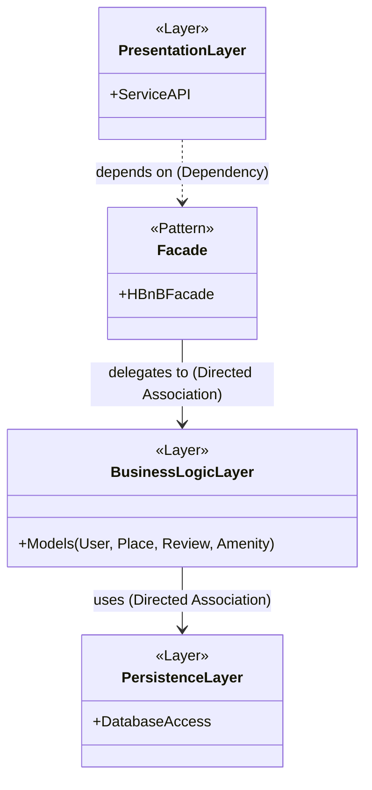
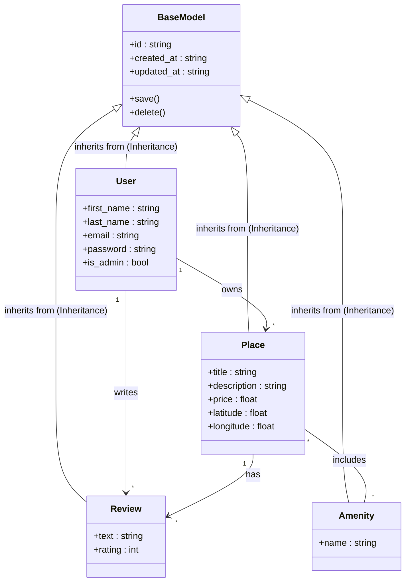
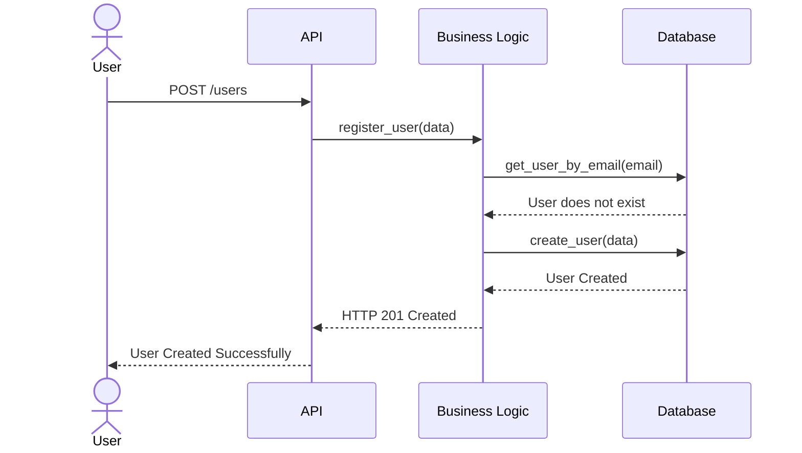
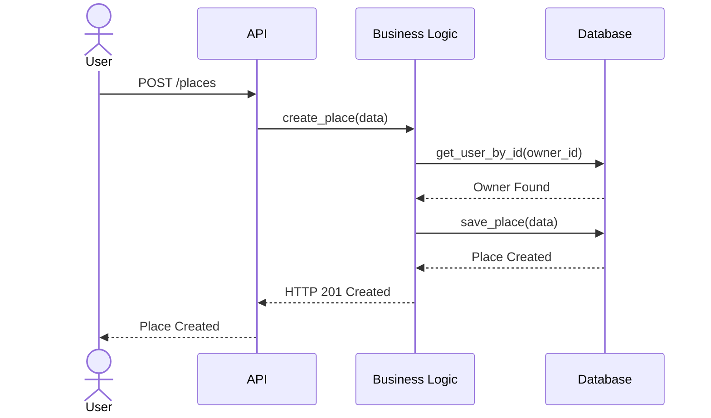
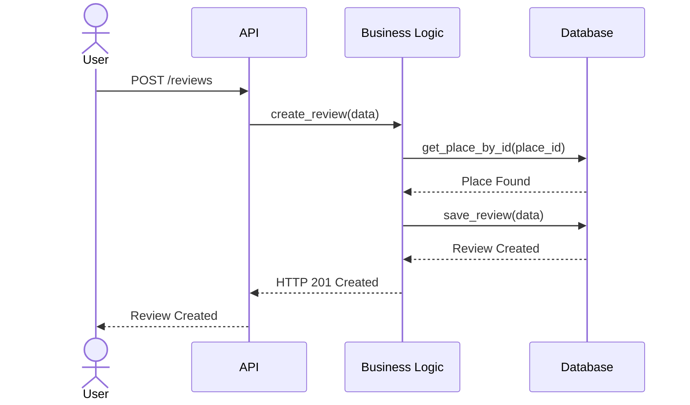

# HBnB Clone - Architecture & System Documentation

## Introduction
This documentation provides a comprehensive overview of the HBnB system architecture, core entities, and operational workflows. The project follows a layered architecture to ensure separation of concerns, scalability, and maintainability.

---

## Task 0: High-Level Architecture (Package Diagram)

### Diagram Explanation
This High-Level Package Diagram illustrates the strict 3-tier architecture of the HBnB application. It visualizes a linear flow where each layer only communicates with the layer directly beneath it, ensuring strict separation of concerns.

**System Components & Flow:**
1. **Presentation Layer (Services/API):** The entry point of the application. It handles user requests (HTTP protocol) and passes them to the Facade.
2. **Facade:** Acts as a centralized manager for the API. It receives the request and delegates it to the appropriate business logic.
3. **Business Logic Layer (Models):** The core of the application containing Python classes (`User`, `Place`, etc.). It processes the rules and then interacts with the persistence layer.
4. **Persistence Layer:** Responsible for actual data storage (`FileStorage` or `DBStorage`).

**Relationship Types (UML):**
* **Dependency (`..>`) [Presentation -> Facade]:** The API heavily relies on the Facade to function.
* **Directed Association (`-->`) [Facade -> Business Logic]:** The Facade directs commands to the logic layer without needing to know database details.
* **Directed Association (`-->`) [Business Logic -> Persistence]:** The logic layer actively calls the database methods to save or retrieve data.
---

## Task 1: Core Models & Business Logic (Class Diagram)

### Diagram Explanation
This Class Diagram represents the core business models (entities) of the HBnB application and illustrates their attributes, methods, and relationships.

**Core Components:**
1. **`BaseModel`:** The parent class for all entities. It handles the initialization of common attributes such as a unique `id` (UUID), `created_at`, and `updated_at` timestamps, as well as common methods like `save()` and `delete()`.
2. **Entity Models:** Classes like `User`, `Place`, `Review`, and `Amenity` define the specific properties (e.g., `email`, `price`, `rating`) required for each object.

**Relationship Types (UML):**
* **Inheritance (`<|--`):**
  All models (`User`, `Place`, `Review`, `Amenity`) inherit from `BaseModel`. This ensures code reusability, as every object automatically receives an ID and timestamps without rewriting the logic.
* **One-to-Many Association (`1 --> *`):**
  * A `User` can own multiple `Places` (owns).
  * A `User` can write multiple `Reviews` (writes).
  * A `Place` can have multiple `Reviews` (has).
* **Many-to-Many Association (`* -- *`):**
  A `Place` can include multiple `Amenities`, and an `Amenity` (like Wi-Fi or Pool) can belong to multiple `Places` (includes).

---

## Task 2: System Workflows (Sequence Diagrams)

### 2.1 User Registration Flow

### Diagram Explanation
This Sequence Diagram maps out the step-by-step process of a new user registration. It highlights the interaction between the User, the API interface, the Business Logic layer, and the Database. The flow ensures data validation (checking if the email already exists) before persisting the new user record and returning a successful HTTP 201 Created response.

---

### 2.2 Place Creation Flow

### Diagram Explanation
This sequence illustrates the creation of a new property (Place) listing. Before allowing the creation to proceed, the Business Logic layer actively queries the Database to verify that the `owner_id` provided in the request corresponds to a valid, existing User. Once validated, the new Place is successfully saved.

---

### 2.3 Review Submission Flow

### Diagram Explanation
This diagram outlines the process of a user leaving a review for a specific place. Similar to the Place Creation flow, the system enforces data integrity by confirming that the target `place_id` exists in the Database before the review data is saved. This ensures that no reviews are attached to non-existent properties.
