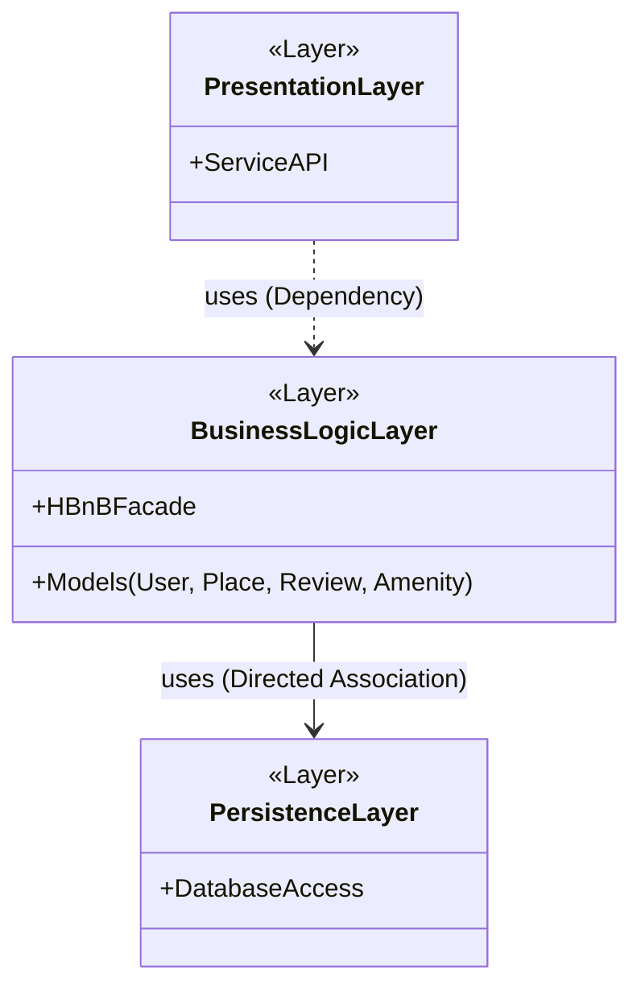
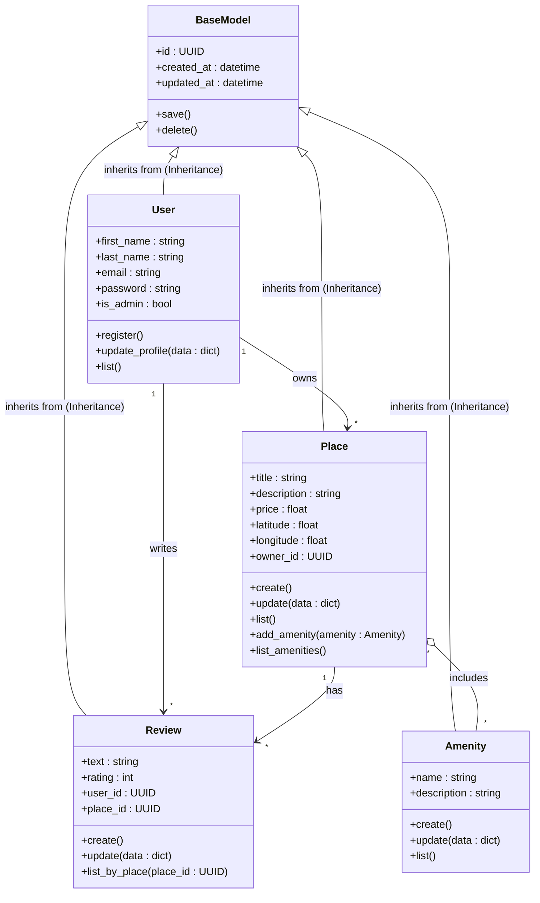
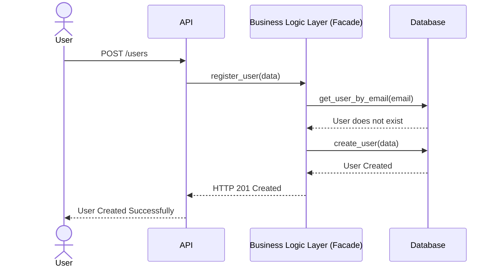
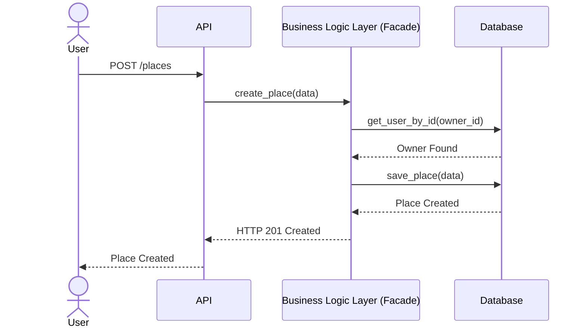
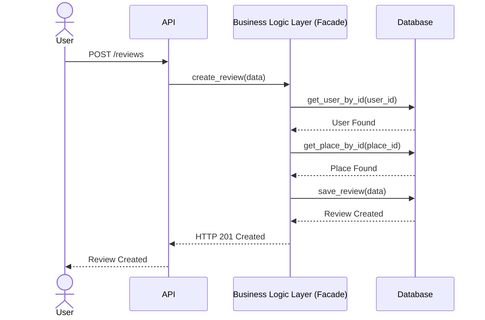
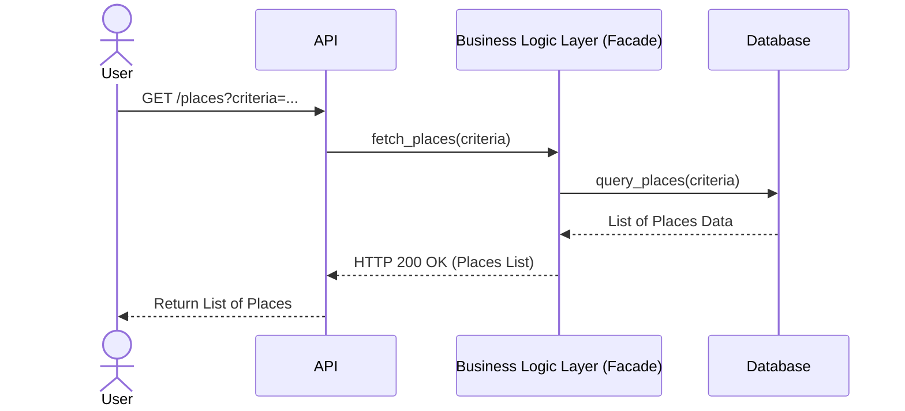

# HBnB Clone - Architecture & System Documentation

## Introduction
This documentation provides a comprehensive overview of the HBnB system architecture, core entities, and operational workflows. The project follows a layered architecture to ensure separation of concerns, scalability, and maintainability.

---

## Task 0: High-Level Architecture (Package Diagram)

### Diagram Explanation
This High-Level Package Diagram illustrates the strict 3-tier architecture of the HBnB application. It visualizes a linear flow where each layer only communicates with the layer directly beneath it, ensuring strict separation of concerns. The Facade is the entry point inside the Business Logic Layer, exposed to the Presentation Layer so that layer never has to know about individual model classes.

**System Components & Flow:**
1. **Presentation Layer (Services/API):** The entry point of the application. It handles user requests (HTTP protocol) and calls into the Business Logic Layer through its exposed Facade interface.
2. **Business Logic Layer (Models + Facade):** The core of the application. The `HBnBFacade` class lives inside this layer and acts as its single point of contact, receiving calls from the Presentation Layer and routing them internally to the appropriate Python classes (`User`, `Place`, `Review`, `Amenity`), which enforce the business rules.
3. **Persistence Layer:** Responsible for actual data storage, accessed only by the Business Logic Layer.

**Relationship Types (UML):**
* **Dependency (`..>`) [Presentation -> Business Logic]:** The Presentation Layer only *uses* the Facade's interface at call-time to invoke an operation. It is not structurally coupled to its internals, which is why it's a dependency rather than an association.
* **Directed Association (`-->`) [Business Logic -> Persistence]:** The Business Logic Layer holds an ongoing, structural reference to the database access object and repeatedly calls it to save or retrieve data over the object's lifetime. This is a stronger, structural relationship than a dependency, which is why it's an association.
---

## Task 1: Core Models & Business Logic (Class Diagram)

### Diagram Explanation
This Class Diagram represents the core business models (entities) of the HBnB application and illustrates their attributes, methods, and relationships.

**Core Components:**
1. **`BaseModel`:** The parent class for all entities. It handles the initialization of common attributes required across the system: a unique `id` (`UUID`), and `created_at` / `updated_at` timestamps (`datetime`) used for audit purposes. It also defines the common `save()` and `delete()` methods, which every entity inherits rather than redefines.
2. **Entity Models:** `User`, `Place`, `Review`, and `Amenity` each define their own specific properties (e.g., `email`, `price`, `rating`) plus the CRUD-style behaviors required by the business rules:
   * **`User`** — `register()` to create a new account, `update_profile()` to modify existing user data, and `list()` to satisfy the "created, updated, deleted, and listed" requirement uniformly across all four entities. `delete()` is inherited from `BaseModel`.
   * **`Place`** — `create()`, `update()`, and `list()`, satisfying the "created, updated, deleted, and listed" requirement. `add_amenity()` and `list_amenities()` represent the explicit requirement that places manage a list of associated amenities. `owner_id` is an explicit foreign key attribute, referencing the `id` of the `User` who owns the place.
   * **`Review`** — `create()` and `update()`, plus `list_by_place(place_id : UUID)`, since reviews must specifically be "listed by place" rather than listed globally. The method takes the `place_id` foreign key. `user_id` and `place_id` are explicit foreign key attributes, referencing the `User` who wrote the review and the `Place` it belongs to.
   * **`Amenity`** — `create()`, `update()`, and `list()`, matching the "created, updated, deleted, and listed" requirement.

**Relationship Types (UML):**
* **Inheritance (`<|--`):**
  All models (`User`, `Place`, `Review`, `Amenity`) inherit from `BaseModel`. This ensures code reusability, as every object automatically receives an ID and timestamps without rewriting the logic.
* **One-to-Many Association (`1 --> *`):**
  * A `User` can own multiple `Places` (owns).
  * A `User` can write multiple `Reviews` (writes).
  * A `Place` can have multiple `Reviews` (has).
  * These associations represent the conceptual link between a `Review` and its `Place`/`User` at the diagram level, while the `_id` foreign key attributes are the concrete fields that implement that link and that the Persistence Layer queries against.
* **Aggregation (`o--`):**
  A `Place` can include multiple `Amenities`, and an `Amenity` can belong to multiple `Places` (includes). This is modeled as aggregation because an `Amenity` can exist and be managed (created, updated, listed) independently of any single `Place`'s lifecycle.
---

## Task 2: System Workflows (Sequence Diagrams)

### 2.1 User Registration Flow

### Diagram Explanation
This Sequence Diagram maps out the step-by-step process of a new user registration. It highlights the interaction between the User, the API interface, the Business Logic Layer (accessed through its Facade), and the Database. The flow ensures data validation (checking if the email already exists) before persisting the new user record and returning a successful HTTP 201 Created response.

---

### 2.2 Place Creation Flow

### Diagram Explanation
This sequence illustrates the creation of a new property (Place) listing. Before allowing the creation to proceed, the Business Logic Layer actively queries the Database to verify that the `owner_id` provided in the request corresponds to a valid, existing User, to assert the business rule that every Place is associated with the User who created it. Once validated, the new Place is successfully saved.

---

### 2.3 Review Submission Flow

### Diagram Explanation
This sequence illustrates the submission of a new review. Because the business rules state that each review is associated with both a specific `Place` **and** a specific `User`, the Business Logic Layer validates both relationships against the Database, first confirming the reviewing `User` exists, then confirming the target `Place` exists before the review is persisted. Only once both checks succeed is the review saved and a `HTTP 201 Created` response returned.

---

### 2.4 Fetching a List of Places Flow

### Diagram Explanation
This sequence illustrates how a user retrieves a list of places based on specific search criteria (e.g., location, price, amenities). The request flows from the User through the API to the Business Logic Layer, which queries the Database. The Database returns the matching records, which are then formatted and sent back to the User along with a successful HTTP 200 OK response.

---

### Message Types (UML)
These conventions apply consistently across all four sequence diagrams above:
* **Synchronous Message (`->>`):** Represents a blocking request flowing downward through the layers (User → API → Business Logic Layer → Database) — each layer waits for a response before proceeding.
* **Return Message (`-->>`):** Represents the response or data payload traveling back up through the layers to be presented to the User.